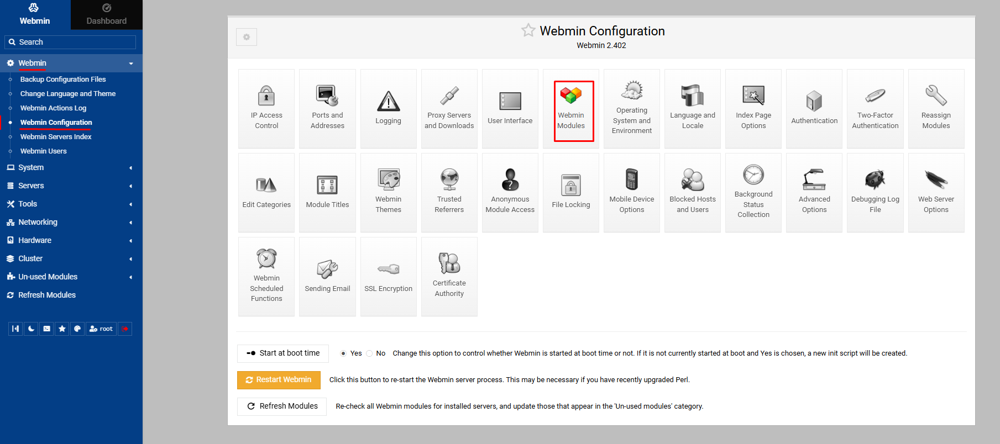
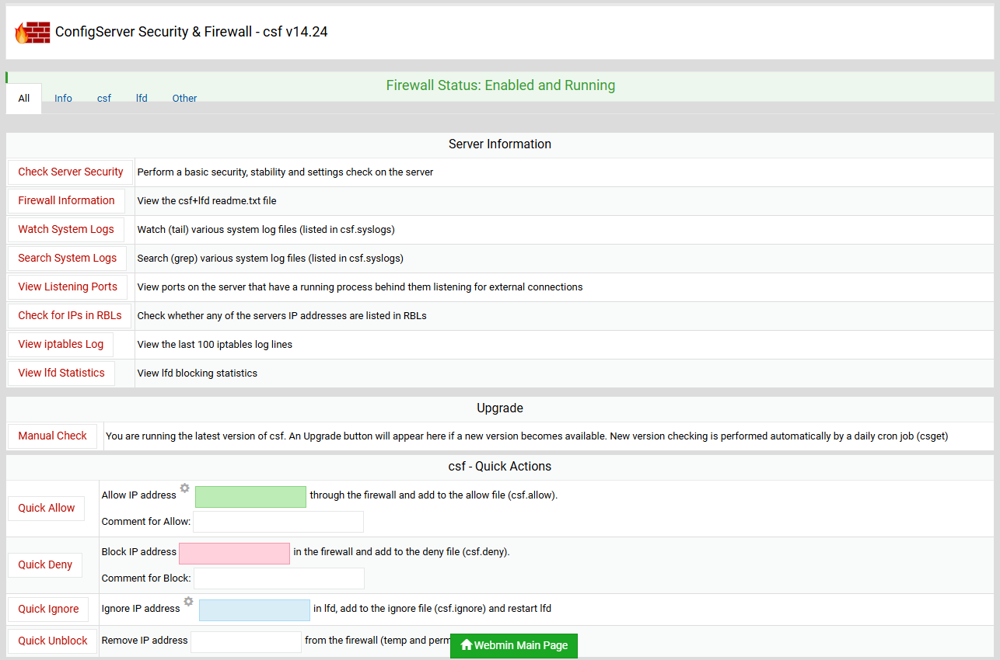
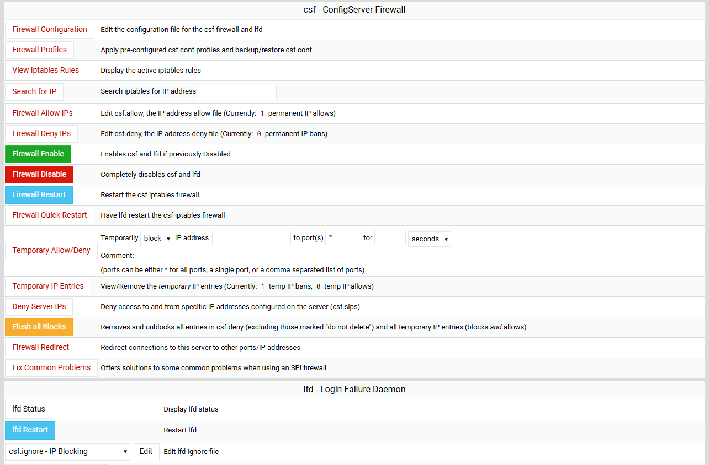
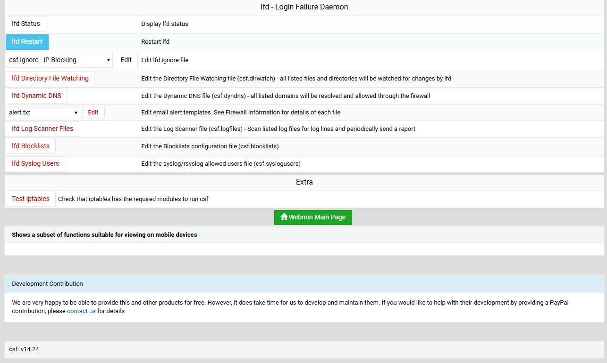

## CSF (ConfigServer Security & Firewall):

CSF (**ConfigServer Security & Firewa**ll) is a powerful and versatile firewall configuration tool for Linux servers, particularly popular in web hosting environments like cPanel / WHM, DirectAdmin and Webmin. It provides both a **packet-filtering firewall**, typically using `iptables` (or `nftables` on newer systems), and Login/Intrusion Detection to secure your server.

CSF configures the firewall to restrict access to your services and allows only connections you specify. It includes the the ability to enable publicly maintained blocklists which block known malicious IP’s and automatically update these blocklists at specified time intervals.


### Key Features:

| Feature                          | Description                                                         |
| -------------------------------- | ------------------------------------------------------------------- |
| **Iptables/Nftables-based**      | Works on top of `iptables` or `nftables` to filter network traffic. |
| **Login Failure Daemon (LFD)**   | Detects brute-force attacks and blocks IPs automatically.           |
| **UI Integration**               | Can be integrated with cPanel, DirectAdmin, Webmin, etc.            |
| **Country blocking**             | Allows blocking or allowing entire countries (GeoIP).               |
| **Port scanning detection**      | Automatically blocks port scanners using LFD.                       |
| **Temporary and permanent bans** | Supports both temporary and permanent IP bans.                      |
| **Easy configuration**           | Controlled by a single configuration file: `/etc/csf/csf.conf`.     |


### Prerequisites:
- CSF works on most Linux distros: CentOS, RHEL, Debian, Ubuntu, etc.
- Perl installed. CSF is written in Perl.
- Disable `firewalld` (CSF conflicts with firewalld so it must be disabled.)


### Install required packages:

```
yum install wget perl ipset unzip net-tools iptables-services perl-libwww-perl perl-LWP-Protocol-https perl-GDGraph -y
```


```
yum install bind-utils -y

apt-get install dnsutils -y
```


### Download and Install CSF: 

```
cd /opt
wget https://download.configserver.com/csf.tgz
```


```
tar -xzf csf.tgz
cd csf
```


```
sh install.sh
```


_Checks if required Perl modules and iptables are available:_
```
perl /usr/local/csf/bin/csftest.pl


Testing ip_tables/iptable_filter...OK
Testing ipt_LOG...OK
Testing ipt_multiport/xt_multiport...OK
Testing ipt_REJECT...OK
Testing ipt_state/xt_state...OK
Testing ipt_limit/xt_limit...OK
Testing ipt_recent...OK
Testing xt_connlimit...OK
Testing ipt_owner/xt_owner...OK
Testing iptable_nat/ipt_REDIRECT...OK
Testing iptable_nat/ipt_DNAT...OK

RESULT: csf should function on this server
```


```
systemctl enable csf
systemctl start csf

systemctl enable lfd
systemctl start lfd

systemctl status csf
systemctl status lfd
```


```
csf -v

csf: v14.24 (generic)
```


### Configuration CSF:

The configuration files include:

- `csf.conf` - The main configuration file for controlling CSF.
- `csf.allow` - a list of IP's and CIDR addresses that should always be allowed through the firewall
- `csf.deny` - a list of IP's and CIDR addresses that should never be allowed through the firewall
- `csf.ignore` - a list of IP's and CIDR addresses that lfd should ignore and not block if detected
- `csf.*ignore` - various ignore files that list files, users, IP's that lfd should ignore. See each file for their specific purpose


_Edit CSF Main Config File `/etc/csf/csf.conf`:_

```
#################################
# SECTION:Initial Settings
#################################

### line 11: ENABLING CSF FIREWALL: Change TESTING = "1" to TESTING = "0" (otherwise, lfd daemon will fail to start)
TESTING = "0"           # Disable testing mode


### line 69: 
# 0 = Allow those options listed above to be used and configured
# 1 = Disable all the options listed above and prevent them from being used
# 2 = Disable only alerts about this feature and do nothing else
# 3 = Restrict syslog/rsyslog access to RESTRICT_SYSLOG_GROUP ** RECOMMENDED **
RESTRICT_SYSLOG = "1"


##################################
# SECTION:IPv4 Port Settings
##################################

### line 139:
# Allow incoming TCP ports
TCP_IN = "20,21,22,25,53,853,80,110,143,443,465,587,993,995"

# Allow outgoing TCP ports
TCP_OUT = "20,21,22,25,53,853,80,110,113,443,587,993,995"

# Allow incoming UDP ports
UDP_IN = "20,21,53,853,80,443"

# Allow outgoing UDP ports
# To allow outgoing traceroute add 33434:33523 to this list
UDP_OUT = "20,21,53,853,113,123"

# Allow incoming PING. Disabling PING will likely break external uptime
# monitoring
ICMP_IN = "1"

# Allow outgoing PING
ICMP_OUT = "1"


#################################
# SECTION:General Settings
#################################

### line 310:
# Enable this option if you want lfd to ignore (i.e. don't block) IP addresses
# listed in csf.allow in addition to csf.ignore (the default). This option
# should be used with caution as it would mean that IP's allowed through the
# firewall from infected PC's could launch attacks on the server that lfd
# would ignore
IGNORE_ALLOW = "1"


### line 338: recommended to limit the number of denied IP addresses as having too many blocks may slow down the server performance.
# For implementations wishing to set this value significantly higher, we
# recommend using the IPSET option

DENY_IP_LIMIT = "200"

DENY_TEMP_IP_LIMIT = "100"


###################################
# SECTION:Port Flood Settings
###################################

### line 526:
# Note: This option should ONLY be enabled if you know you are under a SYN
# flood attack as it will slow down all new connections from any IP address to
# the server if triggered
SYNFLOOD = "0"
SYNFLOOD_RATE = "100/s"
SYNFLOOD_BURST = "150"


###################################
# SECTION:Reporting Settings
###################################

### line 663:
# By default, lfd will send alert emails using the relevant alert template to
# the To: address configured within that template. Setting the following
# option will override the configured To: field in all lfd alert emails
#
# Leave this option empty to use the To: field setting in each alert template
LF_ALERT_TO = "info@technbd.net"


#############################################
# SECTION:Country Code Lists and Settings
#############################################

### line 994: CSF provide an option to allow and deny access by country using the CIDR (Country Code).
# WARNING: CC_ALLOW allows access through all ports in the firewall. For this
# reason CC_ALLOW probably has very limited use and CC_ALLOW_FILTER is preferred
# Each option is a comma separated list of CC's, e.g. "US,GB,DE"
CC_DENY = ""
CC_ALLOW = ""


###############################################
# SECTION:Login Failure Blocking and Alerts
###############################################

### line 1152:
# Send an email alert if an IP address is blocked by one of the [*] triggers
LF_EMAIL_ALERT = "1"

### line 1164:
# [*]Enable login failure detection of sshd connections
# SECURITY NOTE: This option is affected by the RESTRICT_SYSLOG option. Read
# this file about RESTRICT_SYSLOG before enabling this option:
LF_SSHD = "5"
LF_SSHD_PERM = "1"


### line 1258: 
# SECURITY NOTE: This option is affected by the RESTRICT_SYSLOG option. Read
# this file about RESTRICT_SYSLOG before enabling this option:
LF_SSH_EMAIL_ALERT = "1"

LF_SU_EMAIL_ALERT = "1"

```


```
systemctl restart csf
systemctl restart lfd

systemctl status csf
systemctl status lfd
```


```
journalctl -u lfd.service
journalctl -u csf.service
```


```
iptables -nL
```


_Check the ports that are open when CSF is running:_
```
csf -p


Ports listening for external connections and the executables running behind them:
Port/Proto Open Conn  PID/User             Command Line                            Executable
22/tcp     4/6  3     (775/root)           /usr/sbin/sshd -D -oCiphers=aes256-g... /usr/sbin/sshd
80/tcp     4/6  -     (780/root)           /usr/sbin/httpd -DFOREGROUND            /usr/sbin/httpd
80/tcp     4/6  -     (1301/apache)        /usr/sbin/httpd -DFOREGROUND            /usr/sbin/httpd
80/tcp     4/6  -     (1304/apache)        /usr/sbin/httpd -DFOREGROUND            /usr/sbin/httpd
80/tcp     4/6  -     (1310/apache)        /usr/sbin/httpd -DFOREGROUND            /usr/sbin/httpd
80/tcp     4/6  -     (12017/apache)       /usr/sbin/httpd -DFOREGROUND            /usr/sbin/httpd
443/tcp    4/6  -     (780/root)           /usr/sbin/httpd -DFOREGROUND            /usr/sbin/httpd
443/tcp    4/6  -     (1301/apache)        /usr/sbin/httpd -DFOREGROUND            /usr/sbin/httpd
443/tcp    4/6  -     (1304/apache)        /usr/sbin/httpd -DFOREGROUND            /usr/sbin/httpd
443/tcp    4/6  -     (1310/apache)        /usr/sbin/httpd -DFOREGROUND            /usr/sbin/httpd
443/tcp    4/6  -     (12017/apache)       /usr/sbin/httpd -DFOREGROUND            /usr/sbin/httpd
556/tcp    -/-  1     (845819/root)        /usr/bin/perl /usr/libexec/webmin/au... /usr/bin/perl
3306/tcp   -/-  -     (1023/mysql)         /usr/libexec/mysqld --basedir=/usr      /usr/libexec/mysqld
33060/tcp  -/-  -     (1023/mysql)         /usr/libexec/mysqld --basedir=/usr      /usr/libexec/mysqld
```


### Basic CSF Commands:

| Command      | Purpose                            |
| ------------ | ---------------------------------- |
| `csf -e`     | Enable the firewall                |
| `csf -x`     | Disable the firewall               |
| `csf -s`     | Start CSF (load rules)             |
| `csf -r`     | Restart CSF (reloads rules)        |
| `csf -l`     | List current rules and banned IPs  |
| `csf -t`     | Show temporary bans                |
| `csf -f`     | Flushes (removes) all CSF firewall rules and disables CSF temporarily  |
| `csf -a IP`  | Allow IP permanently               |
| `csf -d IP`  | Deny IP permanently                |
| `csf -tr IP` | Remove temporary ban for an IP     |
| `csf -dr IP` | Remove a permanent ban (deny rule) |
| `csf -ar IP` | Remove an allow rule               |
| `csf -df IP` | Delete a specific deny rule (removes an IP from blocklist)  |


#### Search for a pattern match on iptables e.g : [IP, CIDR, Port Number]:
```
csf -g 192.168.0.10
```

#### To allow incoming connections from 192.168.0.10:
```
csf -a 192.168.0.10
```


#### Deny connections originating from 192.168.0.11:
```
csf -d 192.168.0.11
```


#### Block IP Temporarily:
```
csf -td 192.168.1.100 3600 "Temporary block for 1 hour"
```

#### Unblock temporarily block an IP:
```
csf -tr 192.168.1.100
```


#### Block Ping (ICMP) in CSF:

Edit CSF config file and change it to: `ICMP_IN = "1`" to "0": 
```
vim /etc/csf/csf.conf

ICMP_IN = "0"
```


```
csf -r 
```


### Install Webmin CSF Module (optional):

```
dnf install -y epel-release

dnf install -y perl perl-Net-SSLeay openssl perl-IO-Tty
```


```
cat <<EOF > /etc/yum.repos.d/webmin.repo
[Webmin]
name=Webmin Distribution Neutral
baseurl=https://download.webmin.com/download/yum
enabled=1
gpgcheck=1
gpgkey=https://download.webmin.com/jcameron-key.asc
EOF
```


```
dnf install -y webmin
```


```
systemctl enable webmin
systemctl start webmin
systemctl status webmin
```


#### Access CSF via Webmin:

Log in to Webmin: `https://<your-server-ip>:10000`

Webmin Login Info:
- Username:	root
- Password:	Your root password


#### To install module:

```
ll /etc/csf/csfwebmin.tgz

lrwxrwxrwx 1 root root 28 Jul 13 18:31 /etc/csf/csfwebmin.tgz -> /usr/local/csf/csfwebmin.tgz
```

1. Navigate to Webmin select `Webmin` - `Webmin Configuration` - `Webmin Modules`:




`NOTE`: if you are using "Authentic Theme 18.10" you should remove "`csf.min.js`" file because of a bug:

```
rm /usr/libexec/webmin/authentic-theme/extensions/csf/csf.min.js -f
```


2. Wow configure your ConfigServer Security & Firewall. Select `System` - `ConfigServer Security & Firewall` in your Webmin instance.


#### Test Directly (Optional): 

```
https://<your-server-ip>:10000/csf/index.cgi
```








### Links:
- [configserver.com](https://configserver.com/configserver-security-and-firewall/)
- [webmin.com](https://webmin.com/docs/third-party-modules/configserver-security-and-firewall/)


